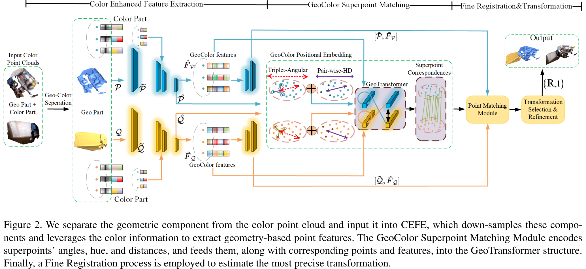

# ColorPCR: Color Point Cloud Registration with Multi-Stage Geometric-Color Fusion 

PyTorch implementation of the paper:

[ColorPCR: Color Point Cloud Registration with Multi-Stage Geometric-Color Fusion ](https://openaccess.thecvf.com/content/CVPR2024/html/Mu_ColorPCR_Color_Point_Cloud_Registration_with_Multi-Stage_Geometric-Color_Fusion_CVPR_2024_paper.html).

[Juncheng Mu](https://scholar.google.com/citations?user=bVmTK8gAAAAJ), Lin Bie, [Shaoyi Du](https://scholar.google.com/citations?user=r2bk4sQAAAAJ), [Yue Gao](https://scholar.google.com/citations?user=UTDfWocAAAAJ)

## Introduction

Point cloud registration is still a challenging and open problem. For example, when the overlap between two point clouds is extremely low, geo-only features may be not sufficient. Therefore, it is important to further explore how to utilize color data in this task. Under such circumstances, we propose ColorPCR for color point cloud registration with multi-stage geometric-color fusion. We design a Hierarchical Color Enhanced Feature Extraction module to extract multi-level geometric-color features, and a GeoColor Superpoint Matching Module to encode transformation-invariant geo-color global context for robust patch correspondences. In this way, both geometric and color data can be used, thus leading to robust performance even under extremely challenging scenarios, such as low overlap between two point clouds. To evaluate the performance of our method, we colorize 3DMatch/3DLoMatch datasets as Color3DMatch/Color3DLoMatch and evaluations on these datasets demonstrate the effectiveness of our proposed method. Our method achieves state-of-the-art registration recall of **97.5%/88.9%** on them.


## Installation

Please use the following command for installation.

```bash
# Create a new environment and activate it
conda create -n colorpcr python==3.8
conda activate colorpcr

# install pytorch
conda install pytorch==1.7.1 cudatoolkit=11.0 -c pytorch
# Install packages and other dependencies
pip install -r requirements.txt
# install open3d
conda install -c open3d-admin open3d=0.11.2

python setup.py build develop
```

## Pre-trained Weights

The pre-trained weights can be downloaded in the [release](https://github.com/mujc2021/ColorPCR/releases/tag/ckpts) page. Please put it in `weights` directory.

## Color3DMatch/Color3DLoMatch

### Data preparation

The dataset can be downloaded [here](https://drive.google.com/file/d/1pQEo0086ipWwNrroAk_ybnhKildq4o_j/view?usp=sharing). The data is organized as follows

```text
--dataset
         |--data--train--7-scenes-chess--cloud_bin_0.npy
               |      |               |--...
               |      |--...
               |--test--7-scenes-redkitchen--cloud_bin_0.npy
                      |                    |--...
                      |--...
```

### Training

The training code can be found in `experiments/ColorPCR`. Use the following command for training:

```bash
CUDA_VISIBLE_DEVICES=0 python trainval.py
```

### Testing

To test your model, use the following command:

```bash
# 3DMatch
CUDA_VISIBLE_DEVICES=0 ./eval.sh epoch benchmark
```

`epoch` is the epoch id, `benchmark` can be replaced by [3DMatch, 3DLoMatch, first, second, third, forth]. Different benchmark has different overlap [>0.3, 0.1-0.3, 0.1-0.15, 0.15-0.2, 0.2-0.25, 0.25-0.3]

We also provide pretrained weights in `weights`, use the following command to test the pretrained weights.

```bash
CUDA_VISIBLE_DEVICES=0 python test.py --snapshot=../../weights/ckpts.pth.tar --benchmark=3DMatch
CUDA_VISIBLE_DEVICES=0 python eval.py --benchmark=3DMatch --method=lgr
```


## Multi-GPU Training

To perform multi-gpu training, use the following command:

```bash
CUDA_VISIBLE_DEVICES=GPUS python -m torch.distributed.launch --nproc_per_node=N_GPU --master_port=PORT trainval.py
# example
CUDA_VISIBLE_DEVICES=0,5 python -m torch.distributed.launch --nproc_per_node=2 --master_port='29501' trainval.py
```

## Citation

```bibtex
@inproceedings{mu2024colorpcr,
  title={ColorPCR: Color Point Cloud Registration with Multi-Stage Geometric-Color Fusion},
  author={Mu, Juncheng and Bie, Lin and Du, Shaoyi and Gao, Yue},
  booktitle={Proceedings of the IEEE/CVF Conference on Computer Vision and Pattern Recognition},
  pages={21061--21070},
  year={2024}
}
```

## Acknowledgements
- [PREDATOR](https://github.com/prs-eth/OverlapPredator)
- [CoFiNet](https://github.com/haoyu94/Coarse-to-fine-correspondences)
- [GeoTransformer](https://github.com/qinzheng93/GeoTransformer)